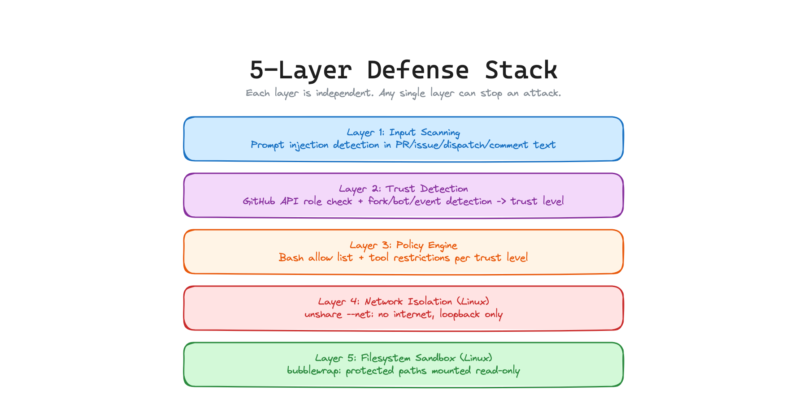

# Trust Badger: Design Document

## The Problem


AI coding agents in CI/CD pipelines have full tool access (bash, git, npm, file I/O, secrets) but process completely untrusted input (PRs from strangers, issues from anyone, fork contributions). Nothing between the agent and the tools decides whether a tool call should be allowed based on who triggered it.

A fork PR from a stranger and an internal PR from an admin give the agent the exact same permissions. Every major attack in Q1 2026 (Hackerbot Claw, PromptPwnd, Clinejection, RoguePilot) exploited this gap.

## The Solution


Trust Badger is a context-aware MCP proxy that sits between the AI agent and its tools inside CI/CD. It reads the GitHub Actions context (who triggered the workflow, fork vs org, actor role via API) and enforces different tool policies based on trust level, with kernel-level sandboxing on Linux.

The agent thinks it has full access. But every tool call goes through Trust Badger's proxy first. The proxy checks the policy, applies network isolation, enforces filesystem protections, and either executes the tool or blocks it.

### Why this is different from existing tools

**PolicyLayer Intercept** is an MCP proxy with YAML policies, but it has zero CI/CD awareness. It applies the same policy to every caller regardless of who triggered the workflow.

**GitHub Agentic Workflows** enforces boundaries for their own agent runtime, but the policies are static (set by the workflow author) and don't modulate based on the triggering actor's trust level.

**Promptfoo MCP Proxy** gates which MCP servers are reachable (server level), not which operations within a server are allowed (operation level).

**Aikido Opengrep** scans your workflow YAML for vulnerable patterns (static analysis). It does not enforce anything at runtime.

**Trust Badger is the only tool that adjusts what the agent can do based on who triggered the workflow, with kernel-level enforcement.** This is the missing primitive.

## Trust Levels


Trust Badger assigns one of three trust levels by reading GitHub Actions environment variables and the GitHub API:

### Untrusted
**Who:** Fork PRs, first-time contributors, deleted fork repos, triage permission, unknown actors

**Policy:** Read-only. The agent can read code, search, and browse, but cannot execute Bash commands, write files, push code, or install packages. No Bash at all.

**Why:** An external contributor you have never seen before should not trigger an agent with shell access. This would have stopped Clinejection (Bash was blocked entirely for untrusted actors).

### Contributor
**Who:** Repo collaborators with read or write permission, maintain permission, bot actors (capped regardless of their actual permission)

**Policy:** Bash commands are restricted to an allow list of safe prefixes (npm test, npm run, node, python, go test, cargo test, make, jest, eslint, git status/log/diff). On Linux, all Bash runs inside a network namespace (no internet) and a bubblewrap sandbox (protected paths like .github/workflows/, CLAUDE.md, .cursorrules are read-only). Config file edits via Edit/Write tools are also blocked.

**Why:** Known collaborators can run tests and read code, but cannot modify the CI/CD pipeline, agent configuration, or exfiltrate data over the network.

### Trusted
**Who:** Repo admins only (not write, not maintain, only admin). Bot actors with admin permission are capped at contributor.

**Policy:** All tools allowed. No restrictions. Input scanning still runs as a warning layer.

**Why:** These are the repo owners. They already have direct access to everything.

## How Context Detection Works

```
setup.js reads:

  Environment variables:
    GITHUB_EVENT_NAME         (pull_request, pull_request_target, issues, push, etc.)
    GITHUB_ACTOR              (who triggered it)
    GITHUB_TRIGGERING_ACTOR   (who actually caused the event, e.g. on re-run)
    GITHUB_REPOSITORY_OWNER   (repo owner)

  GitHub API (using role_name for 5-level precision):
    GET /repos/{owner}/{repo}/collaborators/{actor}
    Returns role_name: admin, maintain, write, triage, read
    Falls back to permission field: admin, write, read, none

  Pull request payload:
    pull_request.head.repo.fork   (true = fork PR)
    pull_request.head.repo        (null = deleted fork)

  Actor type:
    sender.type === 'Bot' or actor.endsWith('[bot]')  (bot detection)

  Additional scanned inputs:
    workflow_dispatch inputs, repository_dispatch client_payload,
    issue_comment body, commit messages
```

Trust mapping:
- Deleted fork or null head.repo = **untrusted**
- Fork PR (head.repo.fork === true) = **untrusted**
- pull_request_target from different repo = **untrusted**
- Admin role (human) = **trusted**
- Admin role (bot) = **contributor** (capped)
- Write or maintain role = **contributor**
- Read or triage role = **untrusted**
- API failure or unknown = **untrusted** (fail-closed)

## 5-Layer Defense Stack



Trust Badger provides defense-in-depth through 5 layers. Each layer is independent.

1. **Input Scanning (heuristic, not a security boundary)** detects known prompt injection patterns (fake errors, HTML comments, hidden Unicode, shell injection, exfiltration language) in PR titles, bodies, branch names, commit messages, issue bodies, comments, and dispatch payloads. This is a regex-based early warning layer. Novel or obfuscated patterns will bypass it. It provides visibility and catches blatant injection in tool arguments, but it is not the security boundary.

2. **Trust Detection** reads GitHub context and API to assign a trust level. Fork PRs and unknown actors are always untrusted. Bots are capped at contributor.

3. **Policy Engine** enforces tool restrictions per trust level. Untrusted gets read-only tools. Contributors get a Bash allow list and file path protections. Trusted gets everything.

4. **Network Isolation** (Linux) runs contributor Bash inside a network namespace with no internet access. Loopback stays up for localhost test servers. Exfiltration via curl, wget, or any network tool fails at the kernel level.

5. **Filesystem Sandbox** (Linux, bubblewrap) mounts protected paths (.github/workflows/, CLAUDE.md, .cursorrules, .claude/, etc.) as read-only. Any command, script, or language that tries to write to these paths gets "Read-only file system" from the kernel.

## How the MCP Proxy Works

Trust Badger's proxy is a stdio MCP server that Claude Code Action spawns via `--mcp-config`. Combined with `--disallowedTools`, the agent can ONLY use tools through the proxy.

```
Agent calls tool
  --> Proxy receives tools/call JSON-RPC message
  --> Normalizes tool name (case-insensitive)
  --> Evaluates policy (allow list, deny rules)
  --> Scans arguments for injection patterns
  --> If denied: return error, log decision
  --> If allowed on Linux contributor:
      --> Write command to temp script file
      --> Execute inside: sudo unshare --net (network isolation)
                          + bubblewrap (filesystem sandbox)
      --> Return result
  --> If allowed on trusted:
      --> Execute directly
      --> Return result
```

The proxy is transport-layer enforcement. It does not process natural language. The agent cannot convince it to allow a blocked call.

## What This Catches (mapped to real attacks)

### Clinejection (full chain)
- **Layer 1 (input scanning):** "Tool error." pattern detected in issue title
- **Layer 2 (trust detection):** Untrusted actor identified
- **Layer 3 (policy):** Bash is completely blocked for untrusted actors
- **Result:** Attack chain never starts. Stages 2 through 5 never happen.

### Hackerbot Claw
- Fork PR triggers untrusted policy
- Agent gets read-only tools
- Cannot push code, modify CODEOWNERS, or edit workflow files
- Cannot replace CLAUDE.md (filesystem sandbox makes it read-only)

### PromptPwnd
- Even if prompt injection in PR body succeeds at the LLM level
- The proxy blocks Bash for untrusted actors
- Network isolation blocks exfiltration for contributors
- The agent literally cannot exfiltrate tokens

## Architecture

```
trust-badger/
  action.yml          GitHub Action: runs setup.js
  src/
    setup.js           Reads context, determines trust, installs bwrap, outputs MCP config
    proxy.js           Stdio MCP proxy: intercepts tools/call, enforces policy, sandboxes execution
    policies.js        Default policies per trust level + Bash allow list
    patterns.js        Input scanning patterns (prompt injection detection)
  tests/
    policies.test.js   Policy evaluation tests (77 tests total)
    proxy.test.js      Proxy enforcement + sandbox tests
    clinejection.e2e.test.js   Full attack chain coverage
  .github/workflows/
    ci.yml             Self-test: unit tests + proxy integration + Claude integration
```

## Integration

```yaml
steps:
  - uses: dolevmiz1/trust-badger@v7
    id: badger
    with:
      mode: enforce

  - uses: anthropics/claude-code-action@v1
    with:
      anthropic_api_key: ${{ secrets.ANTHROPIC_API_KEY }}
      claude_args: >
        --mcp-config '${{ steps.badger.outputs.mcp-config }}'
        --allowedTools 'mcp__trust-badger__*'
        --disallowedTools '${{ steps.badger.outputs.disallowed-tools }}'
```

The `--disallowedTools` flag is critical: it prevents the agent from using native Bash/Read/Write tools that would bypass the proxy. Trust Badger outputs the correct value automatically.

## Design Principles

1. **Simple over clever.** Three trust levels, not a scoring system. Allow list, not command parsing. Stdio proxy, not a distributed service.

2. **Both modes block.** Audit mode and enforce mode both block denied tool calls. The difference: enforce fails the GitHub Actions job. Audit blocks the call but lets the job continue. Start with audit to see what gets blocked.

3. **Transport layer, not prompt layer.** The proxy reads JSON-RPC messages. The sandbox uses kernel namespaces. Neither processes natural language. This makes enforcement immune to prompt injection.

4. **Zero config for the common case.** Default policies work out of the box. Fork PRs get read-only, admins get full access. Override with custom policy files if needed.

5. **Fail closed.** If the permission API fails, trust defaults to untrusted. If bwrap is unavailable, commands are not executed without sandboxing. If the HMAC check fails, the proxy refuses to start.
