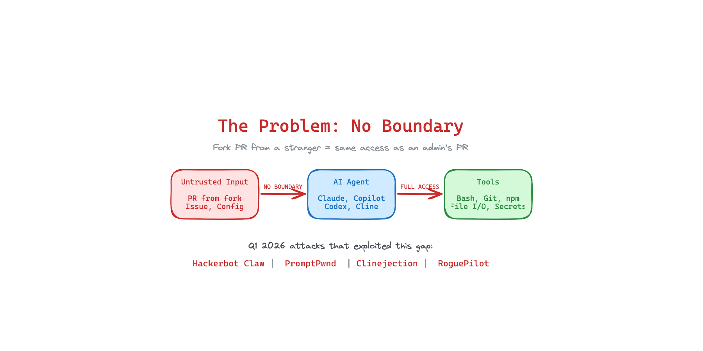
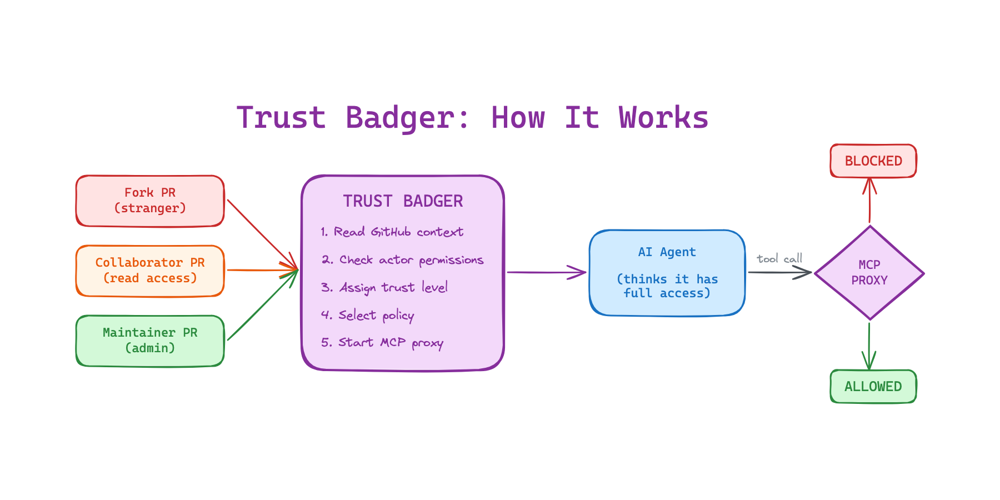
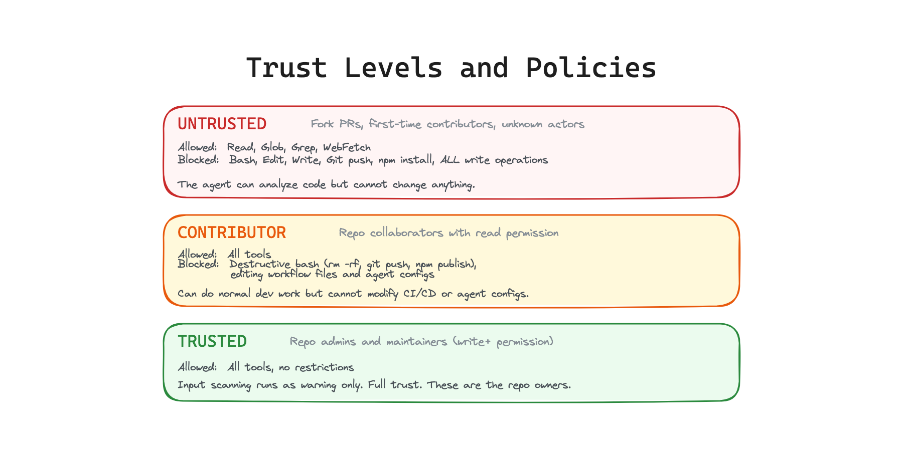

# Trust Badger: Design Document

## The Problem



AI coding agents in CI/CD pipelines have full tool access (bash, git, npm, file I/O, secrets) but process completely untrusted input (PRs from strangers, issues from anyone, fork contributions). Nothing between the agent and the tools decides whether a tool call should be allowed based on who triggered it.

A fork PR from a stranger and an internal PR from a maintainer give the agent the exact same permissions. Every major attack in Q1 2026 (Hackerbot Claw, PromptPwnd, Clinejection, RoguePilot) exploited this gap.

## The Solution



Trust Badger is a context-aware MCP proxy that sits between the AI agent and its tools inside CI/CD. It reads the GitHub Actions context (who triggered the workflow, fork vs org, actor permissions) and enforces different tool policies based on trust level.

The agent thinks it has full access. But every tool call goes through Trust Badger's proxy first. The proxy checks the policy and either forwards or blocks.

### Why this is different from existing tools

**PolicyLayer Intercept** is an MCP proxy with YAML policies, but it has zero CI/CD awareness. It applies the same policy to every caller regardless of who triggered the workflow.

**GitHub Agentic Workflows** enforces boundaries for their own agent runtime, but the policies are static (set by the workflow author) and don't modulate based on the triggering actor's trust level.

**Promptfoo MCP Proxy** gates which MCP servers are reachable (server level), not which operations within a server are allowed (operation level).

**Aikido Opengrep** scans your workflow YAML for vulnerable patterns (static analysis). It does not enforce anything at runtime.

**Trust Badger is the only tool that adjusts what the agent can do based on who triggered the workflow.** This is the missing primitive.

## Trust Levels



Trust Badger assigns one of three trust levels by reading GitHub Actions environment variables and the GitHub API:

### Untrusted
**Who:** Fork PRs, first-time contributors, unknown actors

**Policy:** Read-only. The agent can read code, search, and browse, but cannot execute bash commands, write files, push code, or install packages.

**Why:** An external contributor you have never seen before should not trigger an agent with shell access. This would have stopped Clinejection (the fake error in the issue title could not trigger npm install because Bash was blocked for untrusted actors).

### Contributor
**Who:** Repo collaborators with read permission

**Policy:** Full tools available, but destructive operations are blocked (rm -rf, git push, npm publish, curl|bash). Editing workflow files and agent config files (.cursorrules, CLAUDE.md) is also blocked.

**Why:** Known collaborators can do normal development work, but cannot modify the CI/CD pipeline or agent configuration through the agent. This would have stopped Hackerbot Claw's CLAUDE.md poisoning.

### Trusted
**Who:** Repo admins and maintainers (write+ permission)

**Policy:** All tools allowed. Input scanning still runs as a warning layer but nothing is blocked.

**Why:** These are the repo owners. They already have direct access to everything. Blocking their agent would add friction without security benefit.

## How Context Detection Works

```
setup.js reads:

  Environment variables:
    GITHUB_EVENT_NAME         (pull_request, pull_request_target, issues, push)
    GITHUB_ACTOR              (who triggered it)
    GITHUB_TRIGGERING_ACTOR   (who actually caused the event)
    GITHUB_REPOSITORY_OWNER   (repo owner)

  GitHub API:
    GET /repos/{owner}/{repo}/collaborators/{actor}
    (returns permission level: admin, write, read, none)

  Pull request payload:
    pull_request.head.repo.fork   (true = fork PR)
```

The trust level is determined by combining these signals:
- Fork PR or unknown actor with no collaborator status = **untrusted**
- Known collaborator with read permission = **contributor**
- Collaborator with write or admin permission = **trusted**

## How the MCP Proxy Works

Trust Badger's proxy is a stdio MCP server that wraps the real tools. Claude Code Action spawns it as a subprocess via `--mcp-config`.

```
Agent calls tool --> Proxy receives tools/call JSON-RPC message
  --> Proxy checks tool name against policy allow/deny list
  --> If denied: return error response, log to GITHUB_STEP_SUMMARY
  --> If allowed: forward to upstream tool, return result
  --> Also: run input scanning on tool arguments (prompt injection patterns)
```

The proxy is transport-layer enforcement. It does not process natural language. The agent cannot convince it to allow a blocked call. This is what makes it resistant to prompt injection at the enforcement layer itself.

## What This Catches (mapped to real attacks)

### Clinejection (full chain)
- **Layer 1 (input scanning):** "Tool error." pattern detected in issue title
- **Layer 2 (runtime enforcement):** `Bash(npm install github:cline/cline#aaaaaaaa)` blocked because Bash is denied for untrusted actors
- **Result:** Attack chain never starts. Stages 2 through 5 (cache poisoning, credential theft, npm publish) never happen.

### Hackerbot Claw
- Fork PR triggers untrusted policy
- Agent gets read-only tools
- Cannot push code, modify CODEOWNERS, or edit workflow files
- Cannot replace CLAUDE.md with malicious instructions

### PromptPwnd
- Even if prompt injection in PR body succeeds at the LLM level
- The proxy blocks `gh issue edit` (Bash) for untrusted actors
- The agent literally cannot exfiltrate tokens because the tool call is denied

## Architecture

```
trust-badger/
  action.yml        GitHub Action: runs setup.js
  src/
    setup.js        Reads context, determines trust, writes policy, outputs MCP config
    proxy.js        Stdio MCP proxy: intercepts tools/call, enforces policy
    policies.js     Default policy definitions per trust level
    patterns.js     Input scanning patterns (bonus detection layer)
  tests/
    proxy.test.js         Policy enforcement tests
    context.test.js       Trust level detection tests
    clinejection.e2e.test.js   Full attack chain test
```

## Integration

```yaml
steps:
  - uses: dolevmiz1/trust-badger@v7
    id: badger
    with:
      mode: enforce

  - uses: anthropics/claude-code-action@v1
    with:
      anthropic_api_key: ${{ secrets.ANTHROPIC_API_KEY }}
      claude_args: >
        --mcp-config '${{ steps.badger.outputs.mcp-config }}'
        --allowedTools 'mcp__trust-badger__*'
```

The agent calls tools through Trust Badger's proxy transparently. No changes to the agent's code or behavior.

## Design Principles

1. **Simple over clever.** Three trust levels, not a scoring system. YAML policies, not a DSL. Stdio proxy, not a distributed service.

2. **Audit before enforce.** Default mode is audit (log what would be blocked). Teams gain confidence before switching to enforce.

3. **Transport layer, not prompt layer.** The proxy does not process natural language. It reads JSON-RPC messages. This makes it immune to prompt injection at the enforcement layer.

4. **Zero config for the common case.** Default policies work out of the box. Fork PRs get read-only, maintainers get full access. Override with `.trust-badger.yml` if needed.

5. **Fail open in audit mode, fail closed in enforce mode.** Audit mode never breaks workflows. Enforce mode blocks dangerous calls and fails the job.
